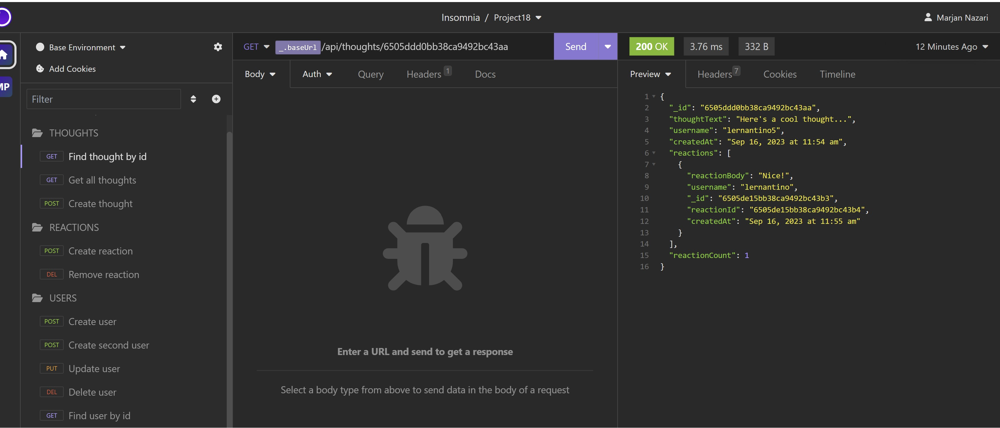

# Social-Network-API

## Description
Social Network API is an application where users can share their thoughts, react to friends’ thoughts, and create a friend list.

## Table of Contents

- [User Story](#user-story)
- [Features](#features)
- [Installation](#installation)
- [Usage](#usage)
- [Technologies](#technologies)
- [Mockup](#mockup)

## User Story
``````
AS A social media startup
I WANT an API for my social network that uses a NoSQL database
SO THAT my website can handle large amounts of unstructured data
``````

## Features
1. This is a social network API that uses MongoDB, a NoSQL database, which allows the website to handle large amounts of unstructured data.
2. When the command to invoke the application is entered, the Mongoose models are synced to the MongoDB database.
3. When API GET routes for users and thoughts are opened in Insomnia, the data for each of the routes is displayed in formatted JSON.
4. **User**, **Friend**, **Thought**, and **Reaction** routes are created to create the database and test the API on Insomnia.
5. **User Routes** - a user can create a user with a username and valid email address. When created, the user is assigned a unique user ID.
- To create a user, click the `POST` request and enter the user's username and email address. Click Send.
- There are two `GET` requests that return user information. To return all users, click the `Find All Users` request, then click on Send. To return a single user, click the `Find User by Id` request. On the URL, enter the user's ID.
- To update a user by ID, click the `PUT` request. On the URL, enter the ID of the user whose information is going to be updated.
- To delete a user by ID, click the `DELETE` request and enter the user's ID.
- A message that reads, `"User and thoughts deleted!"` will appear if the user has been deleted from the database. If there is no such user or user ID in the system, the message, `"No user with this id!"` is shown.
- Click `Find All Users` to see if the user has been deleted.
6. **Friend Routes** - a user can add a friend and delete a friend.
- To add a friend, click the `POST` request. On the URL enter the user ID of the user who is adding a friend, then the user ID of the friend the user is adding. \*(Note: Please see the section on Tests for the API routes.)\*
- To see the user's friends, click `Find All Users`. The ID of the friends the user added are listed under `"friends"`. The `"friendCount"` indicates the number of friends the user added.
- To remove or delete a friend, click the `DELETE` request. On the URL enter the user ID of the user who is deleting a friend, then the user ID of the friend the user is deleting.
- To check if the friend has been removed from the user's friend list, click `Find All Users`.
7. **Thought Routes** - a user can create a thought, get all thoughts or a single thought by ID, update a thought by ID, and delete a thought by ID.
- To create or add a thought, click the `POST` request. Enter the `"thoughtText"`, `"username"`, `"userID"` of the user creating the thought.
- To get all thoughts, click the `GET All Thoughts` request. All the thoughts that were created will appear, as well as the date and time they were created. Each created thought is assigned a unique thought ID. Click `GET All Users` to access the thought ID.
- To get a thought by ID, click the `GET Thought by Id` request and enter the thought ID.
- To update a thought, click the `PUT` request. On the URL, enter the thought ID. Enter the necessary changes on the text body. To see the changes, click `GET All Thoughts`.
- To delete a thought by ID, click the `DELETE` request. On the URL, enter the thought ID that will be deleted.
- When the thought is successfully deleted, the text can no longer be found when you try to access it by clicking `GET All Thoughts.` The thought ID is also deleted when you click `Find All Users.`
8. **Reaction Routes** - a user can create a reaction and delete a reaction.
- To create a reaction, click the `POST` request. On the URL, enter the ID of the thought the user is reacting or commenting on. Then enter the `"reactionBody"` and `"username"` of the user creating the reaction.
- Click on `GET All Thoughts`to see the reaction, the username of the user who created the reaction, the reaction ID, date and time the reaction is created, and the user's reaction count.
- To delete a reaction, click the `DELETE` request. On the URL, enter the ID of the thought the user created a reaction or commented on, then the reaction ID.
- The message, `"No thought with this id!"` will appear when a reaction is deleted or a reaction is not associated with a user ID.
9. MongoDB - After creating data on Insomnia, MongoDB also reflects the same data and changes that were made

## Installation
``````
- Download or clone repository to use this application on local machine.
- `Node.js` and `MongoDB` is required to run the application
- To install necessary dependencies, navigate to the root directory and run the following command:
  `npm i`
``````
## Usage
``````
- To invoke the application, run `npm start`.
- When the server is started, the Mongoose models are synched to the MongoDB database.
- Open MongoDB and connect to the MongoDB URI `mongodb://localhost:27017`. On the list of databases, click on `socialDB` to see `thoughts` and `users` data.
- To create seed data and test the API routes, use [Insomnia](https://insomnia.rest/download). Also, see the Tests section below.
``````
## Technologies
``````
- JavaScript
- Express.js
- Node.js
- MongoDB
- Mongoose
- Insomnia
``````

## Mockup
[A walkthrough video that demonstrates the functionality of the social media API](https://drive.google.com/file/d/18NqFHt5XwMdNyxwfAbN0Ub-8vWdGv4hK/view)

The following animations show examples of the application's API routes being tested in Insomnia.

The following animation shows the GET, POST, PUT, and DELETE routes for users being tested in Insomnia:


The following animation shows GET and POST routes to return all thoughts being tested in Insomnia:





The following animation shows the POST, PUT, and DELETE routes for reaction being tested in Insomnia:


The following animation shows the POST and DELETE routes for friend being tested in Insomnia:


The following animation shows the database and collections in MongoDB:


